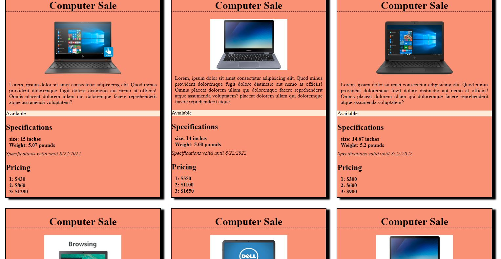

# Product cards
This was an individual exercise to build a page with multipl cards.  

The product cards page has one page which lists all differnt kinds of computers available and information about their price and size.

It gave me a chance to practice on my css skills specialy flex-boxy some more. 

## Screenshots




## How to run this project:

* Use nmp to install htpp-server:

```sh

npm install -g http-server

```
* Run the server:

```sh

hs -p 9999

```

* Open Chrome and navigate to:

```

localhost:9999

```
